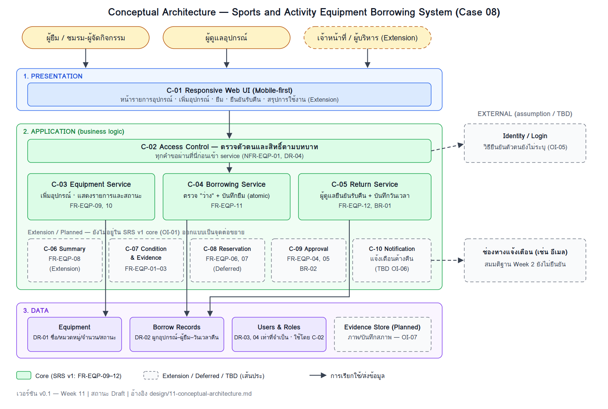

# 11 — Conceptual Architecture

> **Week 11 deliverable — Case 08: ระบบยืม–คืนอุปกรณ์กีฬาและกิจกรรม**
> เวอร์ชัน: v0.1 | สถานะ: Draft (รอ peer review) | ทีม: Team 08
> ฐานอ้างอิง: [SRS v1](../docs/07-srs-v1.md) (Case-08-SRS-W07-v1), [Requirement Models v2](../docs/06-requirement-models-v2.md), [Decision Log](../project-management/decision-log.md)

## 1. Architecture Overview

ระบบออกแบบเป็น **เว็บแอปพลิเคชันแบบแบ่งชั้น 3 ชั้น (Layered Web Application)** ที่รองรับหน้าจอมือถือเป็นหลัก (mobile-first) โดยแบ่งหน้าที่ดังนี้

| ชั้น | หน้าที่ | Component |
|---|---|---|
| **1. Presentation** | แสดงหน้าจอและรับคำสั่งจากผู้ใช้ ไม่มีกติกาธุรกิจ | C-01 |
| **2. Application** | ตรวจสิทธิ์ และบังคับกติกาธุรกิจ (ตรวจสถานะ "ว่าง" ก่อนยืม, ผู้ดูแลเท่านั้นที่ยืนยันรับคืน) | C-02 ถึง C-05 (Core) และ C-06 ถึง C-10 (Extension/Planned) |
| **3. Data** | เก็บรายการอุปกรณ์ รายการยืม และข้อมูลผู้ใช้/สิทธิ์เท่าที่จำเป็น | Equipment, Borrow Records, Users & Roles, (Evidence Store — Planned) |

**หลักการที่ใช้กำหนดโครงสร้าง**

1. **Core ก่อน ต่อขยายได้ภายหลัง** — SRS v1 ครอบคลุมเฉพาะ FR-EQP-09 ถึง 12 (เพิ่มอุปกรณ์, ดูรายการ/สถานะ, ยืม, รับคืน) ส่วน requirement ที่ถูกตัดออกหรือเลื่อน (บันทึกสภาพ/ภาพ, จองล่วงหน้า, อนุมัติอุปกรณ์พิเศษ, แจ้งเตือนค้างคืน, สรุปการใช้งาน) ถูกวางเป็น component แบบเส้นประ เพื่อให้เห็นว่าต่อเข้ากับโครงเดิมได้โดยไม่ต้องรื้อ
2. **กติกาธุรกิจอยู่ชั้น Application ที่เดียว** — UI ไม่ตัดสินเองว่าใครยืม/คืนได้ เพื่อให้ผลตรงกันทุกอุปกรณ์ที่ใช้งาน
3. **เก็บข้อมูลส่วนบุคคลเท่าที่จำเป็น** (privacy by design; Case Card, NFR-EQP-01) — ข้อมูลผู้ยืมแยกอยู่ใน Users & Roles และเชื่อมกับรายการยืมเท่านั้น

> **หมายเหตุขอบเขต:** Week 2 Baseline (D-01) ระบุว่าระบบควรมีการตรวจสภาพ แจ้งเตือน และจองล่วงหน้า แต่ SRS v1 / W06 v2 ตัดส่วนเหล่านี้ออกโดยยังไม่มี Change Request (OI-01) เอกสารนี้จึงแยก Core ออกจาก Extension ให้ชัด และจะปรับ Core ตามผลการตัดสินใจเรื่อง OI-01

## 2. Architecture View

> ไฟล์ภาพ: `diagrams/architecture/conceptual-architecture.png` (ต้นฉบับ SVG: `conceptual-architecture.svg`)
> เส้นทึบ/กล่องสีเขียว = Core ใน SRS v1 | เส้นประ = Extension, Deferred หรือ TBD

**ลำดับการทำงานหลัก (Core flow)**

1. ผู้ใช้เปิด C-01 → คำขอผ่าน C-02 ตรวจตัวตนและบทบาท
2. **เพิ่ม/ดูอุปกรณ์:** C-03 อ่าน/เขียน Equipment (ผู้ดูแลเท่านั้นที่เพิ่มได้)
3. **ยืม:** C-04 ตรวจว่าอุปกรณ์ "ว่าง" แล้วบันทึก Borrow Record และเปลี่ยนสถานะเป็น "ถูกยืม" ใน transaction เดียว ถ้าไม่ว่างให้ปฏิเสธและแจ้งผู้ใช้ (AC-03, AC-04)
4. **คืน:** ผู้ดูแลตรวจอุปกรณ์ แล้วยืนยันผ่าน C-05 → บันทึกวันเวลาที่คืนใน Borrow Record และเปลี่ยนสถานะเป็น "ว่าง" (AC-06; BR-01)

## 3. Components / Modules

### 3.1 Core components (SRS v1)

| Component | Responsibilities | Inputs/Outputs | Related Requirements |
|---|---|---|---|
| **C-01 Responsive Web UI** | แสดงรายการอุปกรณ์/สถานะ ฟอร์มเพิ่มอุปกรณ์ หน้ายืม หน้ายืนยันรับคืน; แสดงข้อความแจ้งผิดพลาด (เช่น "อุปกรณ์ไม่ว่าง"); ใช้ได้บนมือถือโดยไม่ต้องฝึก | In: การกด/กรอกของผู้ใช้ — Out: คำขอไปยัง C-02, ผลลัพธ์/ข้อความจาก service | FR-EQP-09–12; NFR-EQP-03; UC-01–04 |
| **C-02 Access Control** | ยืนยันตัวตนและตรวจบทบาทก่อนเข้าถึงทุก service (ผู้ดูแลอุปกรณ์ / ผู้ยืม-ชมรม / เจ้าหน้าที่-ผู้บริหาร); จำกัดการมองเห็นข้อมูลผู้ใช้ | In: ข้อมูลยืนยันตัวตน, คำขอ — Out: อนุญาต/ปฏิเสธ พร้อมบทบาท | NFR-EQP-01; DR-03, DR-04; AS-01; CT-02 |
| **C-03 Equipment Service** | เพิ่มรายการอุปกรณ์ (ชื่อ หมวดหมู่ จำนวน) พร้อมตรวจฟิลด์บังคับ; แสดงรายการอุปกรณ์ทั้งหมดและสถานะปัจจุบัน (ว่าง/ถูกยืม) | In: ข้อมูลอุปกรณ์ใหม่, คำขอดูรายการ — Out: รายการอุปกรณ์+สถานะ, ข้อความแจ้งเมื่อข้อมูลไม่ครบ | FR-EQP-09, FR-EQP-10; DR-01; UC-01, UC-02; AC-01, AC-02 |
| **C-04 Borrowing Service** | ตรวจสถานะ "ว่าง" และสร้างรายการยืมเป็นหน่วยเดียว (atomic) แล้วเปลี่ยนสถานะเป็น "ถูกยืม"; ปฏิเสธเมื่ออุปกรณ์ไม่ว่าง | In: อุปกรณ์ที่เลือก + ผู้ยืม/ชมรม — Out: Borrow Record, สถานะใหม่ หรือข้อความ "ไม่ว่าง" | FR-EQP-11; DR-01, DR-02, DR-03; UC-03; AC-03, AC-04 |
| **C-05 Return Service** | รับคำยืนยันรับคืนจากผู้ดูแลเท่านั้น; บันทึกวันเวลาที่คืน; เปลี่ยนสถานะเป็น "ว่าง"; แจ้งเมื่อไม่พบรายการยืมที่ตรงกัน | In: การยืนยันรับคืนของผู้ดูแล — Out: Borrow Record ที่ปิดแล้ว, สถานะ "ว่าง" หรือข้อความ "ไม่พบข้อมูลการยืม" | FR-EQP-12; BR-01; DR-02; UC-04; AC-06 |

### 3.2 Extension / Planned components (ยังไม่อยู่ใน SRS v1 core)

| Component | สถานะ | Responsibilities (แนวคิด) | จุดต่อเข้ากับโครงเดิม | Related Requirements |
|---|---|---|---|---|
| **C-06 Summary Service** | Extension (Could) | สรุปจำนวนครั้งที่อุปกรณ์ถูกยืมและสถานะปัจจุบัน สำหรับเจ้าหน้าที่/ผู้บริหาร (ไม่รวมคำแนะนำจัดซื้อ — ISSUE-EQP-01 Hold) | อ่านจาก Borrow Records (อ่านอย่างเดียว) | FR-EQP-08; DR-05; UC-05; AC-07, AC-08 |
| **C-07 Condition & Evidence Service** | Deferred (Must แต่ยังไม่มี model) | บันทึกสภาพก่อน–หลังยืมพร้อมภาพ/ฟอร์ม และควบคุมสิทธิ์ดูหลักฐาน | เรียกจาก C-04/C-05 และใช้ Evidence Store; ต้องรอผล OI-07 | FR-EQP-01–03; NFR-EQP-02; BR-01 |
| **C-08 Reservation Service** | Deferred (Must แต่ถูกตัดใน W06 v2) | จองล่วงหน้าตามช่วงเวลา และป้องกันการจองทับซ้อน | ใช้ตรรกะตรวจก่อนบันทึกแบบเดียวกับ C-04 แต่ตรวจเป็นช่วงเวลา | FR-EQP-06, FR-EQP-07 |
| **C-09 Approval Service** | Extension | อนุมัติการยืมอุปกรณ์พิเศษและเรียกคืนก่อนกำหนด (ตาม D-02, D-03 ซึ่งยัง Provisional/Needs Validation) | ถูกเรียกจาก C-04 ก่อนบันทึกรายการยืม | FR-EQP-04, FR-EQP-05; BR-02 |
| **C-10 Notification Service** | TBD | แจ้งเตือนผู้ค้างคืน | อ่านกำหนดคืนจาก Borrow Records; ส่งออกผ่านช่องทางภายนอก; ยังไม่มี FR/UC (OI-06) | Week 2 Scope; SRS §8 |

## 4. Data and External Dependencies

### 4.1 ข้อมูล (conceptual — ไม่ใช่ schema)

| Data Store | เก็บอะไร | ใช้โดย | DR |
|---|---|---|---|
| Equipment | ชื่อ หมวดหมู่ จำนวน สถานะ (ว่าง/ถูกยืม) | C-03, C-04, C-05 | DR-01 |
| Borrow Records | ผูกอุปกรณ์กับผู้ยืม/ชมรม และวันเวลาที่คืน | C-04, C-05, (C-06) | DR-02 |
| Users & Roles | ข้อมูลผู้ใช้เท่าที่จำเป็นต่อการยืม–คืน และบทบาท | C-02 | DR-03, DR-04 |
| Evidence Store (Planned) | ภาพ/บันทึกสภาพอุปกรณ์ | C-07 | — (รอ OI-07) |

### 4.2 Dependencies

| Dependency | Purpose | Risks / Constraints | Related Design Decision |
|---|---|---|---|
| ที่เก็บข้อมูลแบบมีธุรกรรม (transactional data store) | เก็บ Equipment, Borrow Records, Users & Roles และรองรับการตรวจ+บันทึกแบบ atomic | ชนิดผลิตภัณฑ์ยังไม่เลือก (ตัดสินใจในขั้น detailed design); หน่วยติดตามอุปกรณ์ (รายชิ้น/รายประเภท) ยังไม่ชัด (OI-04) | D-09 (เสนอ) |
| ระบบยืนยันตัวตน (Identity / Login) | ให้ผู้ใช้เข้าสู่ระบบก่อนใช้งาน (AS-01) | ยังไม่ทราบว่าใช้บัญชีมหาวิทยาลัยหรือระบบของตัวเอง (OI-05); ถ้าใช้บัญชีภายนอกต้องไม่ดึงข้อมูลเกินจำเป็น (CT-02) | D-10 (เสนอ) |
| ช่องทางแจ้งเตือน (เช่น อีเมลมหาวิทยาลัย) | แจ้งผู้ค้างคืน | เป็นสมมติฐานจาก Week 2 ยังไม่ยืนยัน; ยังไม่กำหนดกรณีส่งไม่สำเร็จและข้อมูลที่เปิดเผย (OI-06) | D-11 (เสนอ) |
| ที่เก็บไฟล์ภาพหลักฐาน | เก็บภาพสภาพอุปกรณ์ (เมื่อ C-07 เข้า scope) | ยังไม่รู้รูปแบบหลักฐาน (OI-07); ภาพอาจมีข้อมูลส่วนบุคคล ต้องควบคุมสิทธิ์ (NFR-EQP-02) | D-12 (เสนอ) |
| เบราว์เซอร์บนมือถือ/เดสก์ท็อป | ช่องทางใช้งานของผู้ใช้ทุกกลุ่ม | เกณฑ์ตัวเลขของ NFR-EQP-03 (5 คลิก/375 px) ยังไม่มี evidence รองรับ (OI-08) | D-07 (เสนอ) |

### 4.3 Design Decisions ที่เสนอให้บันทึกใน Decision Log

ยังไม่ได้เพิ่มลง [decision-log.md](../project-management/decision-log.md) เพราะต้องให้ทีมตกลงก่อน (D-01 ถึง D-06 เดิมเป็นการตัดสินใจด้าน requirement)

| ID | Decision (เสนอ) | Options Considered | เหตุผลโดยย่อ |
|---|---|---|---|
| D-07 | ทำเป็น **เว็บแอป responsive (mobile-first)** | A: เว็บแอป responsive / B: แอปมือถือ native / C: เดสก์ท็อปเท่านั้น | ผู้ใช้หลายกลุ่มเข้าถึงได้ทางเบราว์เซอร์โดยไม่ต้องติดตั้ง ตรงกับ NFR-EQP-03; B มีต้นทุนสูงเกิน scope รายวิชา |
| D-08 | โครงสร้าง **layered monolith** (3 ชั้น) | A: layered monolith / B: microservices | ขอบเขตเล็ก ทีม 3 คน; B เพิ่มความซับซ้อนโดยไม่จำเป็น แต่แยก component ตามหน้าที่ไว้เพื่อแยกเป็นส่วนได้ภายหลัง |
| D-09 | ตรวจสถานะ "ว่าง" และบันทึกรายการยืม **ใน transaction เดียว** | A: ตรวจที่ UI ก่อนส่ง / B: ตรวจ+บันทึกแบบ atomic ที่ชั้น Application/Data | A ป้องกันการยืมซ้ำพร้อมกันไม่ได้ (AC-04) |
| D-10 | **Role-based access** ที่ C-02 ด่านเดียว | A: ตรวจสิทธิ์กระจายในแต่ละ service / B: ตรวจที่ด่านเดียว | ลดโอกาสเปิดช่องสิทธิ์ และตรวจสอบง่ายกว่า (NFR-EQP-01) |
| D-11 | **แยก Notification เป็น component ต่างหาก** และคงสถานะ TBD | A: ฝังใน Borrowing / B: แยกเป็น C-10 | ไม่มี FR/UC รองรับ; แยกไว้เพื่อไม่ผูกกับช่องทางที่ยังไม่ยืนยัน |
| D-12 | **แยก Evidence Store** จากข้อมูลธุรกรรม | A: เก็บรวมใน Borrow Records / B: แยก store | หลักฐานภาพมีขนาดและสิทธิ์การเข้าถึงต่างจากข้อมูลธุรกรรม (รอ OI-07) |

## 5. Architecture Rationale

**เหตุผลที่เลือก**

- **เหมาะกับขนาดงาน:** ระบบรองรับอุปกรณ์จำลองจำนวนจำกัด (CT-05) และมีทีม 3 คน โครงแบบแบ่งชั้นเข้าใจง่ายและอธิบายตาม requirement ได้ตรง
- **ตอบปัญหาที่ stakeholder เจอจริง:** ศูนย์รวมข้อมูลเดียว (Equipment + Borrow Records) แทนสมุดกระดาษ (E-01) ทำให้ทราบว่าอุปกรณ์ว่างหรือถูกยืม (G-01) และค้นประวัติได้ในอนาคต
- **ป้องกันยืมซ้ำเป็นกติกาของระบบ:** การตรวจ+บันทึกแบบ atomic (D-09) ทำให้คนสองคนยืนยันอุปกรณ์ชิ้นเดียวกันพร้อมกันไม่ได้ ตรงกับ AC-04
- **ต่อขยายได้:** C-07 ถึง C-10 ต่อเข้ากับ Equipment/Borrow Records ได้โดยไม่ต้องเปลี่ยนโครง Core

**ข้อจำกัด**

- **Architecture ตาม SRS v1 ยังไม่ครอบคลุมปัญหาอันดับ 1 ของ stakeholder** คือการจองซ้ำซ้อนระหว่างชมรม (E-07, FR-EQP-06/07) เพราะ AC-04 กันเฉพาะการยืมอุปกรณ์ที่ "ถูกยืม" อยู่ ไม่ใช่การจองทับช่วงเวลา C-08 จึงเป็นเพียงจุดต่อขยาย ถ้า OI-01 ตัดสินให้กลับเข้า scope ต้องกลับมาออกแบบ C-08 และ data model เป็นรายละเอียด
- **BR-01 (ตรวจสภาพทุกครั้งที่คืน) ยังไม่ถูกบังคับด้วยระบบ** เพราะ UC-04 ไม่บันทึกผลตรวจ (OI-07) ใน Core ผู้ดูแลตรวจนอกระบบแล้วกดยืนยัน จนกว่า C-07 จะเข้า scope
- **BR-02 (อุปกรณ์บางรายการยืมได้เฉพาะกิจกรรมที่อนุมัติ)** ยังไม่มี flow ใน Core (C-09 เป็น Extension)
- **สถานะอุปกรณ์เป็นเพียง "ว่าง/ถูกยืม"** ตาม §7.1 ของ SRS ส่วนสถานะ Borrowed/InUse/ReturnRequested ในแผนภาพ W06 ยังไม่ถูกนิยาม (OI-02) จึงไม่นำมาใส่ในสถาปัตยกรรม
- **ใครเป็นผู้ทำให้อุปกรณ์กลับเป็น "ว่าง"** ขัดกันระหว่าง AC-05 (ผู้ยืม) กับ AC-06/UC-04 (ผู้ดูแล) เอกสารนี้ยึด AC-06 เป็นหลัก ตามที่ SRS v1 เลือก (OI-02)
- **เทคโนโลยีจริง** (ภาษา, framework, ฐานข้อมูลยี่ห้อใด) ยังไม่เลือก — เป็นหน้าที่ของ detailed design (Week 13)

## 6. Quality Attribute Evaluation Questions

| # | คำถาม | คำตอบจากการออกแบบนี้ | ข้อสังเกต / การตรวจสอบ |
|---|---|---|---|
| Q1 | การออกแบบนี้ช่วยให้ **ไม่เกิดการยืมอุปกรณ์ชิ้นเดียวกันซ้อนกัน** ได้อย่างไร | C-04 ตรวจสถานะและบันทึกรายการยืมใน transaction เดียว (D-09) ผู้ยืมคนที่สองจะเห็นว่าไม่ว่างและถูกปฏิเสธ | ตรวจด้วย VF-03 (AC-03, AC-04) ครอบคลุมเฉพาะการยืมซ้ำเมื่อถูกยืมอยู่ ไม่ใช่การจองทับช่วงเวลา (FR-EQP-07 ยัง Deferred) |
| Q2 | **ผู้ใช้บนมือถือ** เข้าถึงได้อย่างไร | เว็บ responsive แบบ mobile-first (C-01, D-07) ไม่ต้องติดตั้งแอป | เกณฑ์ตัวเลข (5 คลิก/375 px) ยังไม่มี evidence — ตรวจด้วย VF-06 หลังทีมตกลงเกณฑ์กับผู้สอน (OI-08) |
| Q3 | **ข้อมูลส่วนบุคคลของผู้ยืม** ถูกจำกัดอย่างไร | แยกเก็บใน Users & Roles ผ่าน C-02 ด่านเดียว; Borrow Records อ้างถึงผู้ยืมเท่าที่จำเป็น; ไม่เชื่อมระบบบัญชี/ค่าปรับ | ตรวจด้วย VF-05 แต่ต้องรอรายการฟิลด์ที่จำเป็น (OI-05) |
| Q4 | ใครทำอะไรได้บ้าง (**สิทธิ์**) | C-02 ตรวจบทบาททุกคำขอ: ผู้ดูแลเท่านั้นที่เพิ่มอุปกรณ์และยืนยันรับคืน; ผู้ยืม/ชมรมดูและยืม | ตารางสิทธิ์ยังไม่ครบ (DR-04, OI-05) |
| Q5 | **ตรวจย้อนหลังได้หรือไม่** ว่าอุปกรณ์อยู่กับใคร | Borrow Records ผูกอุปกรณ์–ผู้ยืม–วันเวลาที่คืน (DR-02) จึงตอบได้ว่าใครถืออยู่ | ยังไม่มีวันเวลายืม กำหนดคืน จำนวนชิ้น (OI-06) และยังไม่มีหลักฐานสภาพ (OI-07) จึงยังตอบเรื่องความชำรุดไม่ได้ |
| Q6 | ถ้า **ต้องเพิ่มการจอง/ตรวจสภาพ/แจ้งเตือน** ภายหลัง ต้องรื้อโครงหรือไม่ | ไม่ต้อง C-07–C-10 ต่อเข้ากับ Equipment/Borrow Records และ C-04/C-05 ตามที่ระบุใน §3.2 | ต้องกลับมาออกแบบข้อมูลละเอียดเมื่อ OI-01 มีคำตัดสิน |
| Q7 | ถ้า **ช่องทางภายนอก** (ยืนยันตัวตน/อีเมล) ใช้ไม่ได้ ระบบกระทบแค่ไหน | ฟังก์ชัน Core ยืม–คืนไม่ขึ้นกับอีเมล (C-10 แยกอิสระ); การเข้าสู่ระบบเป็นจุดพึ่งพาเดียวที่ Core ต้องมี | ยังไม่ทราบวิธียืนยันตัวตน (OI-05) ต้องกำหนดกรณีล้มเหลวใน detailed design |

## 7. Traceability to Requirements และสิ่งที่ต้องยืนยันก่อน baseline

| Requirement | Component | สถานะการออกแบบ |
|---|---|---|
| FR-EQP-09 | C-02, C-03 | ออกแบบแล้ว (ฟิลด์บังคับ/สถานะเริ่มต้นรอ OI-04) |
| FR-EQP-10 | C-01, C-03 | ออกแบบแล้ว |
| FR-EQP-11 | C-02, C-04 | ออกแบบแล้ว (จำนวนชิ้น/ระยะเวลา/กำหนดคืนรอ OI-04–06) |
| FR-EQP-12 / BR-01 | C-02, C-05 | ออกแบบบางส่วน (ผลตรวจสภาพรอ OI-07; ผู้ทำให้เป็น "ว่าง" รอ OI-02) |
| NFR-EQP-01 | C-02, Users & Roles | ออกแบบแล้ว (ฟิลด์ที่จำเป็นรอ OI-05) |
| NFR-EQP-03 | C-01 | ออกแบบแล้ว (เกณฑ์ตัวเลขรอ OI-08) |
| FR-EQP-08 | C-06 | Extension |
| FR-EQP-01–03, NFR-EQP-02 | C-07, Evidence Store | Planned — รอ OI-01, OI-07 |
| FR-EQP-04, 05 / BR-02 | C-09 | Planned — รอ OI-01 และสถานะ D-02, D-03 |
| FR-EQP-06, 07 | C-08 | Planned — รอ OI-01 |

**ต้องทำก่อนส่ง/ก่อน baseline**

- [ ] ทีมตกลง D-07 ถึง D-12 แล้วบันทึกลง `project-management/decision-log.md`
- [ ] ตัดสินใจ OI-01 (Change Request หรือนำ requirement กลับเข้า scope) เพราะกระทบว่า Core ของสถาปัตยกรรมต้องมี C-07/C-08 หรือไม่
- [ ] ให้สมาชิกอย่างน้อย 1 คน review และบันทึกผลใน worklog
- [ ] บันทึกการใช้ AI ช่วยร่างเอกสารนี้ใน `project-management/ai-use-log.md` (ร่างโดย Claude; มนุษย์ต้องตรวจก่อน commit)
- [ ] ตรวจว่าแผนภาพตรงกับตารางใน §3 หลังปรับแก้

> **Commit message ที่แนะนำ:** `design: add conceptual architecture view`
