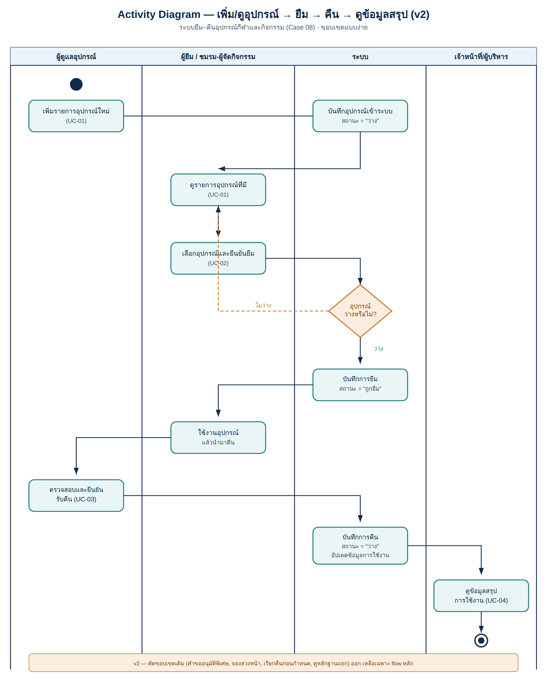

# Activity Diagrams

ใส่ workflow หลักและ alternate flow ที่สำคัญ

## Checklist

- [x] มี source file ที่แก้ไขได้
- [x] มี PNG/PDF export สำหรับใช้ในเอกสาร
- [x] ชื่อไฟล์สื่อถึง purpose
- [x] เชื่อมโยงกับ requirement/design document

## Activity Diagram (เพิ่ม/ดูอุปกรณ์ → ยืม → คืน → ดูข้อมูลสรุป) — v2

Source: [`borrow-return-activity-v2.svg`](borrow-return-activity-v2.svg) · เชื่อมโยงกับ [docs/06-requirement-models.md](../../docs/06-requirement-models.md)

## หมายเหตุ

- v2 คือ diagram เวอร์ชันล่าสุดที่ตรงกับขอบเขต use case แบบง่าย (ตัด flow คำขออนุมัติพิเศษ/จองล่วงหน้า/เรียกคืนก่อนกำหนดออก)
- ไฟล์เวอร์ชันเดิม (`borrow-return-activity.svg/png`) ยังเก็บไว้ในโฟลเดอร์นี้เป็นข้อมูลอ้างอิง ไม่ได้ลบ
