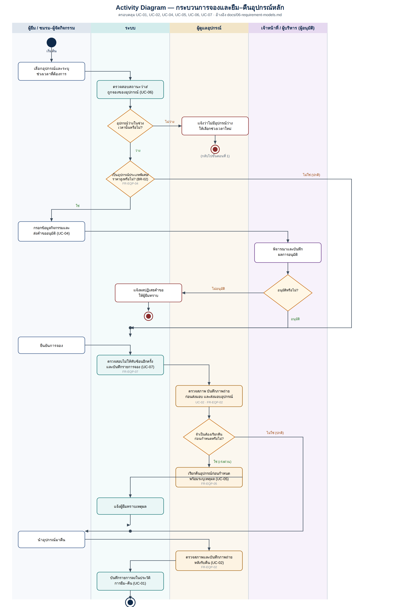

# Activity Diagrams

ใส่ workflow หลักและ alternate flow ที่สำคัญ

## Checklist

- [x] มี source file ที่แก้ไขได้
- [x] มี PNG/PDF export สำหรับใช้ในเอกสาร
- [x] ชื่อไฟล์สื่อถึง purpose
- [x] เชื่อมโยงกับ requirement/design document

## Activity Diagram (ขั้นตอนการยืม–คืนอุปกรณ์)

Source: [`borrow-return-activity.svg`](borrow-return-activity.svg) · เชื่อมโยงกับ [docs/06-requirement-models.md](../../docs/06-requirement-models.md)
