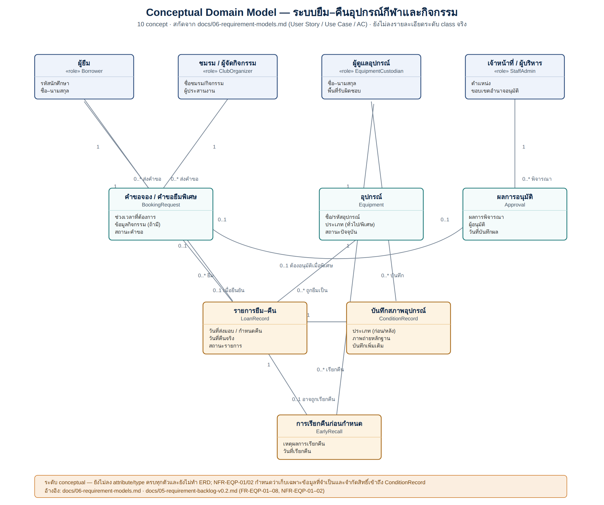

# Domain Models

ใส่ conceptual domain model ก่อนลงรายละเอียด class

## Checklist

- [x] มี source file ที่แก้ไขได้
- [x] มี PNG/PDF export สำหรับใช้ในเอกสาร
- [x] ชื่อไฟล์สื่อถึง purpose
- [x] เชื่อมโยงกับ requirement/design document

## Domain Model (ภาพรวม)

Source: [`domain-model-overview.svg`](domain-model-overview.svg) · เชื่อมโยงกับ [docs/06-requirement-models.md](../../docs/06-requirement-models.md)
