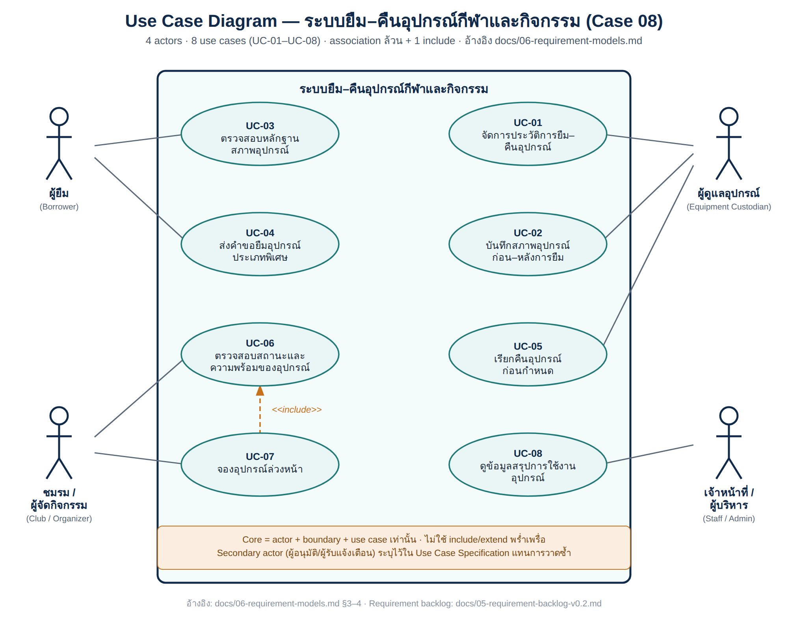

# Use Case Diagrams

ใส่ use case diagram และเชื่อมกับ UC-ID ใน docs/06

## Checklist

- [x] มี source file ที่แก้ไขได้
- [x] มี PNG/PDF export สำหรับใช้ในเอกสาร
- [x] ชื่อไฟล์สื่อถึง purpose
- [x] เชื่อมโยงกับ requirement/design document

## Use Case Diagram (ภาพรวมทั้งระบบ)

Source: [`use-case-overview.svg`](use-case-overview.svg) · เชื่อมโยงกับ [docs/06-requirement-models.md](../../docs/06-requirement-models.md)
