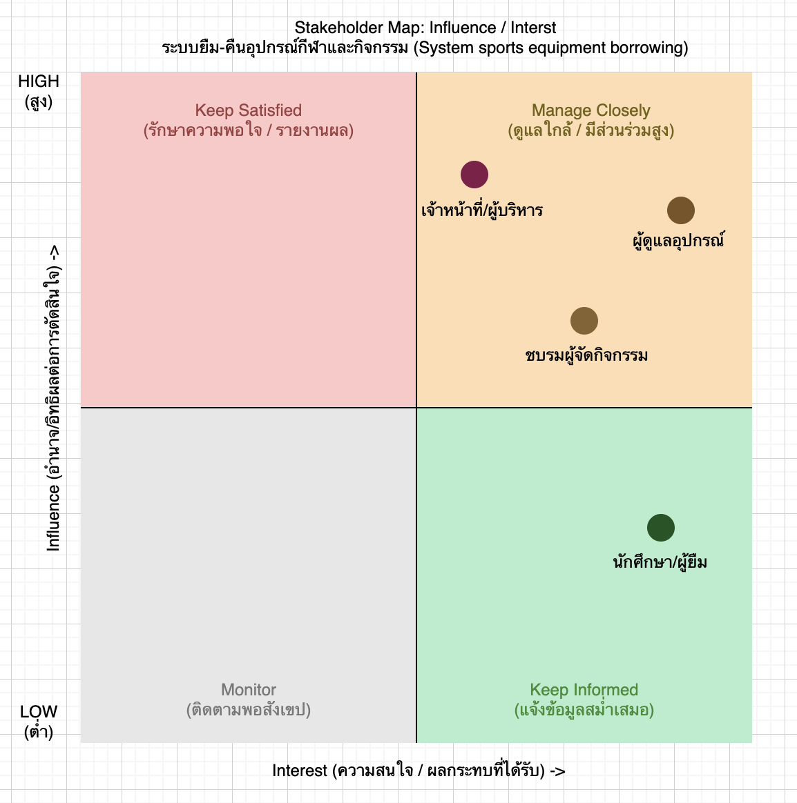
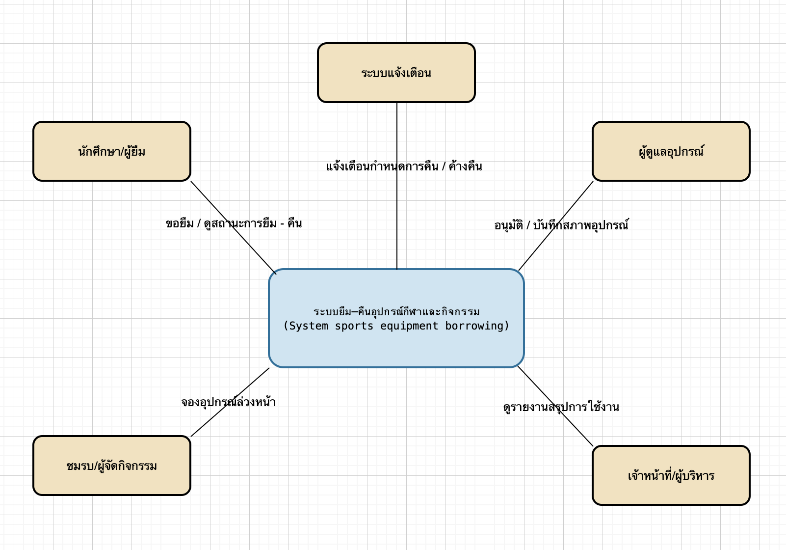

# 02 — Stakeholder, System Context and Scope

> **Week 2 deliverable — Case 08: ระบบยืม–คืนอุปกรณ์กีฬาและกิจกรรม**  
> เวอร์ชัน: v0.1 | สถานะ: Draft | วันที่ปรับปรุง: 13/07/2569 | ทีม: Team 08

## 1. Stakeholder Map

| Stakeholder | Category | Needs / Goals | Influence | Engagement Approach |
|---|---|---|---|---|
| นักศึกษา/ผู้ยืม | Primary user | ตรวจสอบสิทธิ์และยืม–คืนอุปกรณ์ได้สะดวก รวดเร็ว | กลาง | interview |
| ผู้ดูแลอุปกรณ์ (ชมรม/ผู้ดูแลศูนย์) | Primary user | ทราบว่าอุปกรณ์แต่ละชิ้นอยู่กับใคร สภาพเป็นอย่างไร และกำหนดคืนเมื่อใด | สูง | interview + observation |
| ชมรม/ผู้จัดกิจกรรม | Secondary user | จองอุปกรณ์ล่วงหน้าให้ทันวันจัดกิจกรรม โดยเฉพาะเมื่อหลายชมรมต้องการอุปกรณ์ชิ้นเดียวกัน | กลาง | interview |
| เจ้าหน้าที่/ผู้บริหาร | External / decision maker | มีรายงานสรุปการใช้งานอุปกรณ์และปัญหาชำรุด เพื่อวางแผนจัดซื้อ/ซ่อมบำรุง | สูง | review เอกสาร/รายงาน |

> รูป stakeholder map `stakeholder-map.png`

## 2. System Context

ระบบยืม–คืนอุปกรณ์กีฬาและกิจกรรม (ขอบเขต v0.1) ทำหน้าที่เป็นศูนย์กลางบันทึกข้อมูลการยืม–คืน สถานะ และสภาพของอุปกรณ์แต่ละชิ้น สำหรับรายการอุปกรณ์จำลองจำนวนจำกัด โดยมีความสัมพันธ์กับผู้ใช้และระบบ/ช่องทางภายนอกดังนี้:

- **นักศึกษา/ผู้ยืม** — ส่งคำขอยืม ตรวจสอบสิทธิ์ และรับ/ส่งคืนอุปกรณ์
- **ผู้ดูแลอุปกรณ์** — บันทึกและตรวจสภาพอุปกรณ์ก่อน–หลังการยืม อนุมัติการยืมอุปกรณ์พิเศษ
- **ชมรม/ผู้จัดกิจกรรม** — จองอุปกรณ์ล่วงหน้าสำหรับกิจกรรมที่ได้รับอนุมัติ
- **เจ้าหน้าที่/ผู้บริหาร** — เรียกดูรายงานสรุปการใช้งานและปัญหาชำรุด
- **ช่องทางแจ้งเตือน** (เช่น อีเมลของมหาวิทยาลัย) — ระบบภายนอกที่ใช้ส่งการแจ้งเตือนผู้ค้างคืน (สมมติฐาน ยังไม่ยืนยัน)

**ข้อมูลที่เข้า/ออกระบบ:** ข้อมูลผู้ยืม (สิทธิ์การยืม), ข้อมูลอุปกรณ์และสภาพอุปกรณ์ก่อน–หลังยืม, กำหนดคืนและสถานะค้างคืน, คำขอจองอุปกรณ์ล่วงหน้า และรายงานสรุปการใช้งาน/ความชำรุด

> รูป System Context `system-context.png`

## 3. Scope Statement

### In Scope

| Area | Included capability | Rationale |
|---|---|---|
| การยืม–คืนอุปกรณ์ | ยืม–คืนอุปกรณ์กีฬาและกิจกรรมสำหรับรายการอุปกรณ์จำลองจำนวนจำกัด | ตรงตาม Problem Statement |
| ตรวจสภาพอุปกรณ์ | บันทึกและตรวจสภาพอุปกรณ์ทุกครั้งที่คืน | ลดข้อพิพาทเรื่องความชำรุด |
| ติดตามกำหนดคืน | ติดตามกำหนดคืนและแจ้งเตือนผู้ยืมที่ค้างคืน | ลดความล่าช้าในการคืน |
| จองอุปกรณ์ล่วงหน้า | จองอุปกรณ์ล่วงหน้าสำหรับกิจกรรมที่ได้รับอนุมัติ | ลดการจองซ้ำซ้อนระหว่างชมรม |

### Out of Scope

| Area | Excluded capability | Reason |
|---|---|---|
| จัดซื้อครุภัณฑ์ | ระบบจัดซื้อครุภัณฑ์ | อยู่นอกขอบเขตรายวิชา/Case ปัจจุบัน |
| คลังพัสดุมหาวิทยาลัย | ระบบคลังทั้งหมดของมหาวิทยาลัย | ขอบเขตใหญ่เกินกำหนดของรายวิชา |
| บัญชี/ค่าปรับ | ระบบบัญชี/การเก็บค่าปรับ | ไม่ใช่ปัญหาหลักที่ระบุใน Problem Statement |
| QR code จริง | การเชื่อมต่อ QR code จริง | เป็นรายละเอียดการออกแบบ ยังไม่ใช่ requirement ที่ยืนยัน |
| ข้อมูลส่วนบุคคล | การเก็บข้อมูลส่วนบุคคลเกินความจำเป็น | หลักการ privacy by design |

## 4. Constraints and Business Rules

| ID | Constraint / Rule | Source | Impact |
|---|---|---|---|
| BR-01 | ต้องตรวจสภาพอุปกรณ์ทุกครั้งที่คืน | Case Card (Facts) | ต้องมีขั้นตอน/ฟอร์มบันทึกสภาพก่อน–หลังยืมในทุก transaction |
| BR-02 | อุปกรณ์บางรายการยืมได้เฉพาะกิจกรรมที่ได้รับอนุมัติ | Case Card (Facts) | ต้องมีการตรวจสอบสิทธิ์/สถานะอนุมัติก่อนอนุญาตให้ยืม |
| BR-03 (สมมติฐาน) | อุปกรณ์ส่วนใหญ่ยืมได้ครั้งละ 1–3 วัน | Assumption — ยังไม่ยืนยัน | กระทบการคำนวณกำหนดคืนและการแจ้งเตือน; ต้องยืนยันกับผู้ดูแลอุปกรณ์ |
| BR-04 (สมมติฐาน) | ผู้ดูแลอุปกรณ์เป็นผู้มีสิทธิ์อนุมัติการยืมอุปกรณ์พิเศษ | Assumption — ยังไม่ยืนยัน | กระทบการออกแบบสิทธิ์ผู้ใช้ (role/permission) |
| BR-05 (สมมติฐาน) | ชมรมจองอุปกรณ์ล่วงหน้าได้อย่างน้อย 3–7 วันก่อนกิจกรรม | Assumption — ยังไม่ยืนยัน | กระทบ business rule ของการจองล่วงหน้า |

## 5. Ethics, Privacy and Accessibility Considerations

- **ข้อมูลส่วนบุคคลที่ระบบอาจเกี่ยวข้อง:** ชื่อ/รหัสนักศึกษาผู้ยืม และประวัติการยืม–คืนของแต่ละบุคคล ตามหลักการในขอบเขต จะไม่เก็บข้อมูลส่วนบุคคลเกินความจำเป็น (นอกขอบเขต) และจะไม่เชื่อมต่อกับระบบบัญชี/ค่าปรับ
- **ความเสี่ยงด้านสิทธิ์การเข้าถึง/ความปลอดภัย:** ต้องกำหนดสิทธิ์ให้ชัดเจนว่าใครอนุมัติการยืมอุปกรณ์พิเศษได้ (ยังเป็น open question); หลักฐานสภาพอุปกรณ์ก่อน–หลังยืม (ภาพถ่าย/แบบฟอร์ม) ต้องมีการควบคุมการเข้าถึงเพื่อป้องกันข้อพิพาทเรื่องความน่าเชื่อถือของหลักฐาน
- **การเข้าถึงสำหรับผู้ใช้หลากหลายกลุ่ม:** ผู้ดูแลอุปกรณ์และเจ้าหน้าที่อาจมีระดับความคุ้นเคยกับเทคโนโลยีต่างกัน ควรออกแบบขั้นตอนบันทึกข้อมูลให้ใช้งานง่าย ไม่ซับซ้อน
- **ข้อควรระวังด้านจริยธรรม:** ต้องมีหลักฐานสภาพอุปกรณ์ก่อนยืมที่ชัดเจน เพื่อป้องกันการกล่าวหาผู้ยืมอย่างไม่เป็นธรรมกรณีอุปกรณ์ชำรุด (ตามความกังวลที่ระบุใน Problem Brief); ควรมีความโปร่งใสในการจองอุปกรณ์เพื่อลดข้อพิพาทเรื่องการจองซ้ำซ้อนระหว่างชมรม

## 6. Baseline Scope Decision

สรุปสิ่งที่ทีมตกลงใช้เป็น baseline หลัง Week 2:

- ระบบจะครอบคลุมการยืม–คืน การตรวจสภาพอุปกรณ์ทุกครั้งที่คืน การติดตามกำหนดคืน/แจ้งเตือน และการจองอุปกรณ์ล่วงหน้าสำหรับกิจกรรมที่ได้รับอนุมัติ ตามที่ระบุใน In Scope
- ประเด็นที่ยังเป็น assumption (BR-03 ถึง BR-05) จะถูกนำไปยืนยันกับผู้มีส่วนได้ส่วนเสียในสัปดาห์ถัดไป ก่อนนำไปกำหนดเป็น requirement ที่ชัดเจน
- **Open questions หลักที่ต้องติดตาม:** ผู้มีอำนาจอนุมัติการยืมอุปกรณ์พิเศษ, รูปแบบหลักฐานสภาพอุปกรณ์, แนวทางจัดการผู้คืนล่าช้า, จำนวนวันที่เปิดให้จองล่วงหน้า, และ stakeholder กลุ่มเพิ่มเติมที่มีอำนาจตัดสินใจ
