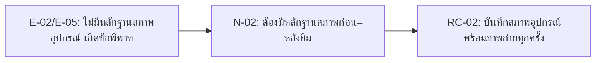

# Week 04 — Evidence-linked Requirement Candidates: ระบบยืม–คืนอุปกรณ์กีฬาและกิจกรรม (Case 08)

> **Important:** รายการนี้เป็น Candidate/Needs Validation สำหรับนำไปวิเคราะห์ จัดหมวด และจัดลำดับใน Week 05 ยังไม่ใช่ baseline หรือ Approved requirement

## 1. Candidate writing rule

แนวทางการแปลงหลักฐานเป็น Requirement Candidate ของทีม:

1. เริ่มจากหลักฐาน (evidence) ที่มี E-ID (ดู `04-evidence-log.md`)
2. เขียนความต้องการ (need) เป็นปัญหา/เป้าหมายของผู้มีส่วนได้ส่วนเสีย พร้อม N-ID
3. เขียน RC เป็นความสามารถ (capability) ของระบบ โดยยังไม่รีบสร้างรายละเอียด UI/technology/penalty ที่ไม่มี evidence
4. ใส่สถานะเป็น `Candidate` (ยังไม่ยืนยัน) หรือ `Needs Validation` (ต้องตรวจสอบเพิ่ม)
5. ระบุสิ่งที่ต้องติดตามต่อ หากยังมีข้อมูลไม่ทราบ (unknown)

## 2. Requirement candidates

| RC ID | Candidate statement | Type | Evidence / Decision | Status | Confidence | Follow-up / acceptance hint |
|---|---|---|---|---|---|---|
| RC-01 | ระบบควรให้ผู้ดูแลอุปกรณ์บันทึกและค้นหาประวัติการยืม–คืนของอุปกรณ์แต่ละชิ้นแบบดิจิทัล แทนที่สมุดบันทึกกระดาษ | Functional | E-01, N-01 | Candidate | Medium | ยืนยันว่าการค้นประวัติที่ต้องการคือระดับรายอุปกรณ์ รายผู้ยืม หรือทั้งสองแบบ |
| RC-02 | ระบบควรบังคับให้ผู้ดูแลอุปกรณ์บันทึกสภาพอุปกรณ์ (พร้อมหลักฐานภาพถ่าย) ทั้งตอนส่งมอบและตอนรับคืน โดยให้ทั้งผู้ดูแลอุปกรณ์และผู้ยืมดูข้อมูลนี้ได้ | Functional/Accountability | E-02, E-05, N-02 | Candidate | High | ยืนยันว่าใครเป็นผู้ถ่ายภาพ และจะเก็บ/รักษาหลักฐานไว้ที่ไหน |
| RC-03 | ระบบควรส่งคำขอไปให้ผู้มีอำนาจระดับสูง (หัวหน้าศูนย์กีฬา/อาจารย์ผู้รับผิดชอบ) อนุมัติ เมื่อคำขอเกี่ยวข้องกับอุปกรณ์ที่จัดเป็นประเภทพิเศษ/ราคาสูง และต้องมีหลักฐานกิจกรรมที่ได้รับอนุมัติพร้อมวันคืนที่ชัดเจน | Functional/Authorization | E-03, N-03 | Needs Validation | Low | ยืนยันเกณฑ์ (ระดับราคา หรือรายการอุปกรณ์) ที่ใช้กำหนดว่าเป็น "อุปกรณ์พิเศษ" |
| RC-04 | ระบบควรรองรับขั้นตอนการเรียกคืนอุปกรณ์ก่อนกำหนด โดยให้ผู้ดูแลอุปกรณ์ตั้งค่าการทวงคืนได้เมื่อมีคำขอที่ขัดแย้งกันสำหรับอุปกรณ์ชิ้นเดียวกัน | Functional/Business rule | E-04, N-04 | Needs Validation | Low | ยืนยันว่าการทวงคืนก่อนกำหนดควรเป็นกฎที่ระบบรองรับอย่างเป็นทางการ หรือเป็นข้อยกเว้นที่จัดการนอกระบบ |
| RC-05 | ระบบควรแสดงสถานะความพร้อมของอุปกรณ์แบบเรียลไทม์ และป้องกันการจองซ้ำซ้อนของอุปกรณ์ชิ้นเดียวกันจากคำขอจองล่วงหน้าที่ทับซ้อนกันของชมรมต่าง ๆ | Functional/Integrity | E-06, E-07, N-05 | Candidate | High | ยืนยันว่าช่วงเวลาจองล่วงหน้าสอดคล้องกันทุกประเภทชมรมหรือไม่ (ปัจจุบันอ้างอิงจากชมรมเดียว: 5–7 วัน) |
| RC-06 | ระบบควรมีรายงาน/แดชบอร์ดสรุปให้เจ้าหน้าที่ดูจำนวนครั้งที่อุปกรณ์แต่ละชิ้นถูกยืม ประวัติความชำรุด สถานะ/ผู้ถือครองปัจจุบัน กำหนดคืน และคำแนะนำเรื่องการซ่อมบำรุง/จัดซื้อ | Functional/Reporting | E-08, N-06 | Needs Validation | Low | ยืนยันความถี่ของรายงานที่ต้องการ (รายสัปดาห์/รายเดือน/เรียลไทม์) และผู้อนุมัติงบจัดซื้อคือใคร |

## 3. Coverage and traceability matrix

| Need (N-ID) | Stakeholder | Evidence (E-ID) | Candidate |
|---|---|---|---|
| N-01 | ผู้ดูแลอุปกรณ์ | E-01 | RC-01 |
| N-02 | ผู้ดูแลอุปกรณ์, นักศึกษา/ผู้ยืม | E-02, E-05 | RC-02 |
| N-03 | ผู้ดูแลอุปกรณ์ | E-03 | RC-03 |
| N-04 | นักศึกษา/ผู้ยืม, ผู้ดูแลอุปกรณ์ | E-04 | RC-04 |
| N-05 | ชมรม/ผู้จัดกิจกรรม (อ้างอิง Q-07) | E-06, E-07 | RC-05 |
| N-06 | เจ้าหน้าที่/ผู้บริหาร | E-08 | RC-06 |

## 4. Quality review

| Check | Result | Note |
|---|---|---|
| Traceable | Pass | RC ทุกข้ออ้าง E-ID และ N-ID |
| No unsupported approval | Pass | ใช้ Candidate/Needs Validation เท่านั้น ไม่มีข้อใดถูกฟันธงเป็น Approved |
| Solution-neutral | Pass with note | RC-02 ระบุว่าต้องมีภาพถ่ายตามหลักฐาน แต่ยังไม่กำหนดเทคโนโลยี/แพลตฟอร์ม |
| Atomic enough for Week 05 | Pass with note | RC-03, RC-04, RC-06 ยังต้องปรับปรุงหลังตรวจสอบเกณฑ์/ขอบเขตเพิ่มเติม |
| Multi-source confirmation | Pass with note | RC-02 และ RC-05 มีความน่าเชื่อถือสูงกว่า RC อื่น เพราะมีหลักฐานยืนยันจากผู้มีส่วนได้ส่วนเสียมากกว่า 1 คน/กลุ่ม |
| Scope check | Flag | RC-06 เป็นความต้องการใหม่ที่เพิ่งปรากฏจากการสัมภาษณ์เจ้าหน้าที่ ยังไม่เคยอยู่ในขอบเขตเดิมของ Week 2 ต้องตรวจสอบผลกระทบต่อ Scope Statement (นอกขอบเขต: บัญชี/ค่าปรับ) |

## 5. Week 05 handoff backlog

### ส่งต่อ Candidate เข้า Backlog

| RC จาก Week 04 | ส่งต่อไป Week 05 หรือไม่? | เหตุผล |
|---|---|---|
| RC-01 | ส่งต่อ | หลักฐานชัดเจนและเป็น core flow (แทนที่สมุดบันทึก) |
| RC-02 | ส่งต่อ | หลักฐานสอดคล้องกันจากผู้มีส่วนได้ส่วนเสีย 2 ฝ่าย (ผู้ดูแลอุปกรณ์ + ผู้ยืม) ควรให้ความสำคัญสูง |
| RC-03 | ส่งต่อ พร้อมปรับปรุงหลังตรวจสอบเพิ่ม | ต้องยืนยันเกณฑ์ "อุปกรณ์พิเศษ" กับหัวหน้าศูนย์กีฬา/อาจารย์ก่อน |
| RC-04 | ต้องปรับปรุง | ต้องตัดสินใจว่าจะทำเป็นกฎของระบบ หรือกระบวนการที่จัดการนอกระบบ ก่อนเขียนเป็น requirement ที่ชัดเจน |
| RC-05 | ส่งต่อ | ผู้มีส่วนได้ส่วนเสียจัดเป็นปัญหาอันดับ 1 (Q-07) ควรมีความสำคัญสูงสุดใน backlog |
| RC-06 | ส่งต่อ พร้อมปรับปรุงหลังตรวจสอบเพิ่ม | เป็นความต้องการใหม่ ต้องตรวจสอบผลกระทบต่อขอบเขตเดิมก่อนนำเข้า backlog เต็มรูปแบบ |

### Analysis tasks

1. จัดประเภท Functional / Business Rule / Authorization / Reporting ให้ชัดเจนขึ้นในแต่ละ RC
2. ยืนยันเกณฑ์ "อุปกรณ์พิเศษ" สำหรับ RC-03 กับหัวหน้าศูนย์กีฬา/อาจารย์ผู้รับผิดชอบ
3. ตัดสินใจว่าการทวงคืนก่อนกำหนด (RC-04) เป็นกฎในระบบหรือกระบวนการนอกระบบ
4. ตรวจสอบ RC-06 กับ Scope Statement Week 2 ว่ากระทบขอบเขตเดิมหรือไม่
5. จัด priority ด้วย value/risk/multi-source confirmation (RC-02, RC-05 มีน้ำหนักสูงสุด) ไม่ใช้ความชอบส่วนบุคคล

### Do not do yet

- อย่ากำหนดรายละเอียดว่าใครถ่ายภาพ/เก็บหลักฐานไว้ที่ไหน (RC-02) จนกว่าจะยืนยัน
- อย่าฟันธงเกณฑ์ราคา/รายการ "อุปกรณ์พิเศษ" (RC-03) โดยไม่มี evidence
- อย่ากำหนดว่าการทวงคืนก่อนกำหนด (RC-04) เป็นฟีเจอร์บังคับ จนกว่าจะตัดสินใจร่วมกับผู้มีส่วนได้ส่วนเสีย
- อย่านำ RC-06 เข้า backlog แบบเต็มรูปแบบ จนกว่าจะตรวจสอบผลกระทบต่อ scope เดิม
- อย่าเลื่อน Candidate/Needs Validation เป็น Approved โดยไม่มี authorized validation
