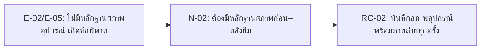

# 04 — Requirement Candidates: ระบบยืม–คืนอุปกรณ์กีฬาและกิจกรรม (Case 08)

## 1. แนวทางการแปลงหลักฐานเป็น Requirement Candidate

หลักคิดของทีม:

1. เริ่มจากหลักฐาน (evidence) ที่มี E-ID (ดู `04-evidence-log.md`)
2. เขียนความต้องการ (need) เป็นปัญหา/เป้าหมายของผู้มีส่วนได้ส่วนเสีย
3. เขียน RC เป็นความสามารถ (capability) ของระบบ
4. ใส่สถานะเป็น `Candidate` (ยังไม่ยืนยัน) หรือ `Needs Validation` (ต้องตรวจสอบเพิ่ม)
5. ระบุสิ่งที่ต้องติดตามต่อ หากยังมีข้อมูลไม่ทราบ (unknown)

## 2. ตาราง Requirement Candidate

| RC-ID | รายละเอียด Requirement Candidate | ผู้มีส่วนได้ส่วนเสีย / Need | E-ID ที่อ้างอิง | สถานะ | สิ่งที่ต้องติดตามต่อ |
|---|---|---|---|---|---|
| RC-01 | ระบบควรให้ผู้ดูแลอุปกรณ์บันทึกและค้นหาประวัติการยืม–คืนของอุปกรณ์แต่ละชิ้นแบบดิจิทัล แทนที่สมุดบันทึกกระดาษ | ผู้ดูแลอุปกรณ์ / N-01 | E-01 | Candidate | ยืนยันว่าการค้นประวัติที่ต้องการคือระดับรายอุปกรณ์ รายผู้ยืม หรือทั้งสองแบบ |
| RC-02 | ระบบควรบังคับให้ผู้ดูแลอุปกรณ์บันทึกสภาพอุปกรณ์ (พร้อมหลักฐานภาพถ่าย) ทั้งตอนส่งมอบและตอนรับคืน โดยให้ทั้งผู้ดูแลอุปกรณ์และผู้ยืมดูข้อมูลนี้ได้ | ผู้ดูแลอุปกรณ์, นักศึกษา/ผู้ยืม / N-02 | E-02, E-05 | Candidate | ยืนยันว่าใครเป็นผู้ถ่ายภาพ และจะเก็บ/รักษาหลักฐานไว้ที่ไหน |
| RC-03 | ระบบควรส่งคำขอไปให้ผู้มีอำนาจระดับสูง (หัวหน้าศูนย์กีฬา/อาจารย์ผู้รับผิดชอบ) อนุมัติ เมื่อคำขอเกี่ยวข้องกับอุปกรณ์ที่จัดเป็นประเภทพิเศษ/ราคาสูง และต้องมีหลักฐานกิจกรรมที่ได้รับอนุมัติพร้อมวันคืนที่ชัดเจน | ผู้ดูแลอุปกรณ์ / N-03 | E-03 | Needs Validation | ยืนยันเกณฑ์ (ระดับราคา หรือรายการอุปกรณ์) ที่ใช้กำหนดว่าเป็น "อุปกรณ์พิเศษ" |
| RC-04 | ระบบควรรองรับขั้นตอนการเรียกคืนอุปกรณ์ก่อนกำหนด โดยให้ผู้ดูแลอุปกรณ์ตั้งค่าการทวงคืนได้เมื่อมีคำขอที่ขัดแย้งกันสำหรับอุปกรณ์ชิ้นเดียวกัน | นักศึกษา/ผู้ยืม, ผู้ดูแลอุปกรณ์ / N-04 | E-04 | Needs Validation | ยืนยันว่าการทวงคืนก่อนกำหนดควรเป็นกฎที่ระบบรองรับอย่างเป็นทางการ หรือเป็นข้อยกเว้นที่จัดการนอกระบบ |
| RC-05 | ระบบควรแสดงสถานะความพร้อมของอุปกรณ์แบบเรียลไทม์ และป้องกันการจองซ้ำซ้อนของอุปกรณ์ชิ้นเดียวกันจากคำขอจองล่วงหน้าที่ทับซ้อนกันของชมรมต่าง ๆ | ชมรม/ผู้จัดกิจกรรม / N-05 | E-06, E-07 | Candidate | ยืนยันว่าช่วงเวลาจองล่วงหน้าสอดคล้องกันทุกประเภทชมรมหรือไม่ (ปัจจุบันอ้างอิงจากชมรมเดียว: 5–7 วัน) |
| RC-06 | ระบบควรมีรายงาน/แดชบอร์ดสรุปให้เจ้าหน้าที่ดูจำนวนครั้งที่อุปกรณ์แต่ละชิ้นถูกยืม ประวัติความชำรุด สถานะ/ผู้ถือครองปัจจุบัน กำหนดคืน และคำแนะนำเรื่องการซ่อมบำรุง/จัดซื้อ | เจ้าหน้าที่/ผู้บริหาร / N-06 | E-08 | Needs Validation | ยืนยันความถี่ของรายงานที่ต้องการ (รายสัปดาห์/รายเดือน/เรียลไทม์) และผู้อนุมัติงบจัดซื้อคือใคร |

## 3. เหตุผลที่ยังเป็นแค่ Candidate ไม่ใช่ Requirement ที่สมบูรณ์

| RC | เหตุผลที่ยังไม่ final |
|---|---|
| RC-01 | ยังไม่รู้ว่าการค้นประวัติที่ต้องการคือระดับอุปกรณ์รายชิ้นหรือรายผู้ยืม |
| RC-03 | ยังไม่มีเกณฑ์ตัวเลข/รายการชัดเจนว่าอุปกรณ์ใดถือเป็น "พิเศษ" |
| RC-04 | ยังไม่ยืนยันว่าการทวงคืนก่อนกำหนดควรเป็นกฎในระบบหรือจัดการนอกระบบ |
| RC-06 | เป็นความต้องการใหม่ที่เพิ่งปรากฏจากการสัมภาษณ์เจ้าหน้าที่ ยังไม่เคยอยู่ในขอบเขตเดิมของ Week 2 ต้องตรวจสอบว่ากระทบขอบเขตโครงงานหรือไม่ |

## 4. การส่งต่อ Candidate เข้า Backlog Week 05

| RC จาก Week 04 | ส่งต่อไป Week 05 หรือไม่? | เหตุผล |
|---|---|---|
| RC-01 | ส่งต่อ | หลักฐานชัดเจนและเป็น core flow (แทนที่สมุดบันทึก) |
| RC-02 | ส่งต่อ | หลักฐานสอดคล้องกันจากผู้มีส่วนได้ส่วนเสีย 2 ฝ่าย (ผู้ดูแลอุปกรณ์ + ผู้ยืม) ควรให้ความสำคัญสูง |
| RC-03 | ส่งต่อ พร้อมปรับปรุงหลังตรวจสอบเพิ่ม | ต้องยืนยันเกณฑ์ "อุปกรณ์พิเศษ" กับหัวหน้าศูนย์กีฬา/อาจารย์ก่อน |
| RC-04 | ต้องปรับปรุง | ต้องตัดสินใจว่าจะทำเป็นกฎของระบบ หรือกระบวนการที่จัดการนอกระบบ ก่อนเขียนเป็น requirement ที่ชัดเจน |
| RC-05 | ส่งต่อ | ผู้มีส่วนได้ส่วนเสียจัดเป็นปัญหาอันดับ 1 (Q-07) ควรมีความสำคัญสูงสุดใน backlog |
| RC-06 | ส่งต่อ พร้อมปรับปรุงหลังตรวจสอบเพิ่ม | เป็นความต้องการใหม่ ต้องตรวจสอบผลกระทบต่อขอบเขตเดิมก่อนนำเข้า backlog เต็มรูปแบบ |

## 5. บทเรียนสำหรับทีม

ตัวอย่างนี้แสดงว่า RC ที่ดีควรตอบได้ว่า:

- อ้างอิงหลักฐานอะไร
- แก้ความต้องการอะไร
- ยังไม่รู้อะไร
- จะตรวจสอบต่อใน Week 05 อย่างไร

ข้อสังเกตเพิ่มเติมจากชุดข้อมูลนี้: RC-02 และ RC-05 มีความน่าเชื่อถือสูงกว่า RC อื่น เพราะมีหลักฐานจากผู้มีส่วนได้ส่วนเสียมากกว่า 1 คน/กลุ่มที่ยืนยันปัญหาเดียวกัน ขณะที่ RC-06 ควรถูกตรวจสอบร่วมกับทีมว่ากระทบ Scope Statement เดิมจาก Week 2 (นอกขอบเขต: บัญชี/ค่าปรับ) หรือไม่ เนื่องจากเป็นความต้องการด้านรายงานที่ไม่เคยถูกกำหนดไว้ล่วงหน้า
