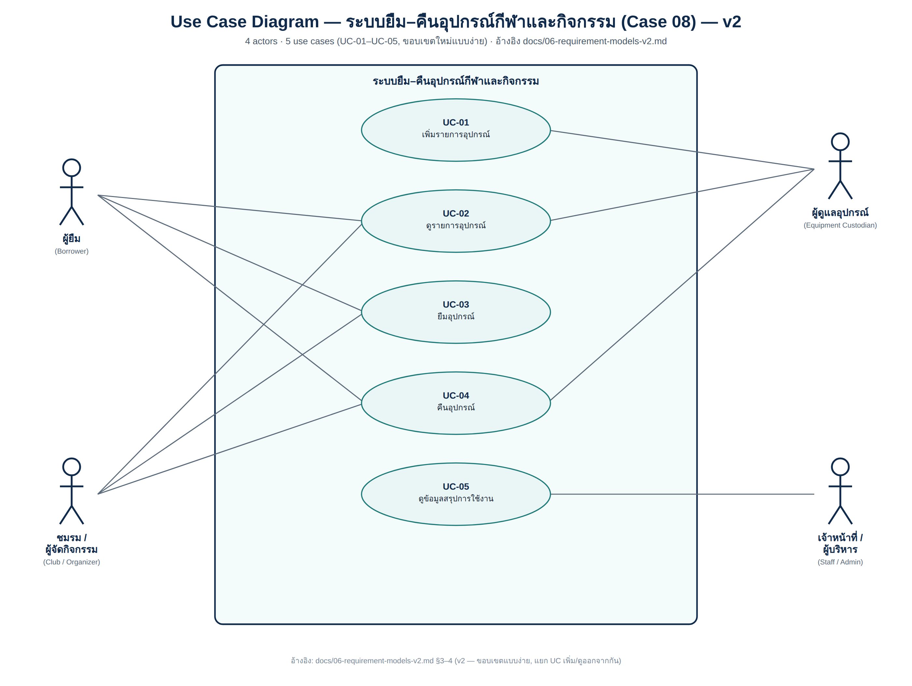
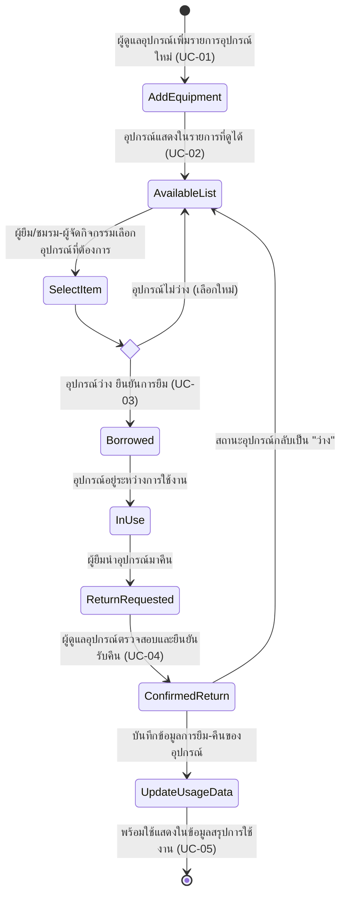
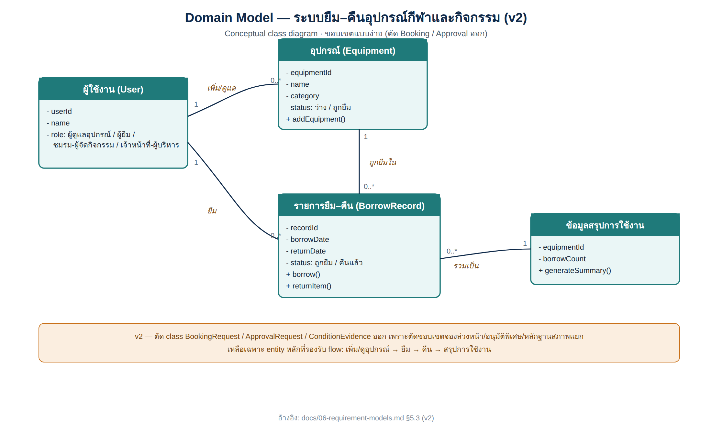

# 06 — Requirement Models: User Stories, Use Cases and Acceptance Criteria

> **Week 6 deliverable**

## 1. User Stories

| **ID** | **Actor** | **Goal** | **Value** | **Priority** | **Linked FR** | **Acceptance Criteria** |
|---|---|---|---|---|---|---|
| US-01 | ผู้ดูแลอุปกรณ์ | เพิ่มรายการอุปกรณ์ใหม่เข้าสู่ระบบ | เพื่อให้ข้อมูลอุปกรณ์ที่มีอยู่ครบถ้วนและพร้อมให้ตรวจสอบก่อนยืม | Must | `FR-EQP-09` | `AC-01` |
| US-02 | ผู้ยืม / ชมรม-ผู้จัดกิจกรรม | ดูรายการอุปกรณ์ทั้งหมดที่มีในระบบพร้อมสถานะ | เพื่อให้ทราบว่ามีอุปกรณ์อะไรบ้างก่อนตัดสินใจยืม | Must | `FR-EQP-10, FR-EQP-06` | `AC-02` |
| US-03 | ผู้ยืม / ชมรม-ผู้จัดกิจกรรม | ยืมอุปกรณ์ที่ต้องการจากระบบ | เพื่อให้สามารถนำอุปกรณ์ไปใช้ในกิจกรรมของตนเองได้ | Must | `FR-EQP-11` | `AC-03, AC-04` |
| US-04 | ผู้ยืม / ชมรม-ผู้จัดกิจกรรม | คืนอุปกรณ์ที่ยืมไปเมื่อใช้งานเสร็จ | เพื่อให้อุปกรณ์กลับเข้าสู่ระบบและพร้อมให้ผู้อื่นยืมต่อได้ | Must | `FR-EQP-12` | `AC-05, AC-06` |
| US-05 | เจ้าหน้าที่/ผู้บริหาร | ดูข้อมูลสรุปการใช้งานอุปกรณ์ | เพื่อใช้ติดตามการใช้งานและวางแผนจัดการอุปกรณ์ | Could | `FR-EQP-08` | `AC-07, AC-08` |

## 2. Acceptance Criteria

### AC-01 — เพิ่มรายการอุปกรณ์ใหม่

- Given ผู้ดูแลอุปกรณ์เข้าสู่ระบบด้วยสิทธิ์ผู้ดูแล
- When ผู้ดูแลอุปกรณ์กรอกข้อมูลอุปกรณ์ใหม่ (ชื่อ, หมวดหมู่, จำนวน) และกดบันทึก
- Then ระบบบันทึกรายการอุปกรณ์ใหม่เข้าสู่ฐานข้อมูล และแสดงในรายการอุปกรณ์ทั้งหมด

### AC-02 — ดูรายการอุปกรณ์ทั้งหมด

- Given ระบบมีข้อมูลอุปกรณ์อยู่แล้ว
- When ผู้ยืมหรือชมรม/ผู้จัดกิจกรรมเปิดหน้ารายการอุปกรณ์
- Then ระบบแสดงรายการอุปกรณ์ทั้งหมดพร้อมสถานะปัจจุบัน (ว่าง/ถูกยืม)

### AC-03 — ยืมอุปกรณ์สำเร็จ

- Given อุปกรณ์ที่ต้องการยืมมีสถานะว่าง
- When ผู้ยืมหรือชมรม/ผู้จัดกิจกรรมเลือกอุปกรณ์และกดยืนยันการยืม
- Then ระบบบันทึกรายการยืมและเปลี่ยนสถานะอุปกรณ์เป็น "ถูกยืม"

### AC-04 — พยายามยืมอุปกรณ์ที่ไม่ว่าง

- Given อุปกรณ์ที่ต้องการยืมมีสถานะ "ถูกยืม" อยู่แล้ว
- When ผู้ยืมหรือชมรม/ผู้จัดกิจกรรมพยายามยืมอุปกรณ์ชิ้นนั้น
- Then ระบบไม่อนุญาตให้ยืมและแจ้งว่าอุปกรณ์ไม่ว่าง

### AC-05 — คืนอุปกรณ์สำเร็จ

- Given มีรายการยืมที่อุปกรณ์อยู่ในสถานะ "ถูกยืม"
- When ผู้ยืมหรือชมรม/ผู้จัดกิจกรรมดำเนินการคืนอุปกรณ์
- Then ระบบบันทึกการคืนและเปลี่ยนสถานะอุปกรณ์กลับเป็น "ว่าง"

### AC-06 — ผู้ดูแลอุปกรณ์ยืนยันรับคืน

- Given ผู้ยืมนำอุปกรณ์มาคืน ณ จุดรับคืน
- When ผู้ดูแลอุปกรณ์ตรวจสอบและกดยืนยันรับคืนในระบบ
- Then ระบบอัปเดตสถานะอุปกรณ์เป็น "ว่าง" และบันทึกวันเวลาที่คืน

### AC-07 — แสดงข้อมูลสรุปการใช้งานอุปกรณ์

- Given ระบบมีข้อมูลการยืม-คืนสะสมอยู่
- When เจ้าหน้าที่หรือผู้บริหารเปิดหน้าข้อมูลสรุปการใช้งาน
- Then ระบบแสดงจำนวนครั้งที่อุปกรณ์แต่ละชิ้นถูกยืมและสถานะปัจจุบัน

### AC-08 — ไม่มีข้อมูลสำหรับสรุป

- Given ระบบยังไม่มีข้อมูลการยืม-คืนของอุปกรณ์ชิ้นใดชิ้นหนึ่ง
- When เจ้าหน้าที่หรือผู้บริหารเปิดดูข้อมูลสรุปของอุปกรณ์ชิ้นนั้น
- Then ระบบแสดงข้อความว่ายังไม่มีข้อมูลการใช้งาน

## 3. Use Case List

| **ID** | **Use Case** | **Primary Actor** | **Goal** | **Related FR** | **Diagram** |
|---|---|---|---|---|---|
| UC-01 | เพิ่มรายการอุปกรณ์ | ผู้ดูแลอุปกรณ์ | เพิ่มอุปกรณ์ใหม่เข้าสู่ระบบ | `FR-EQP-09` | [`../diagrams/use-case/UC-01-v2.png`](../diagrams/use-case/UC-01-v2.png) |
| UC-02 | ดูรายการอุปกรณ์ | ผู้ยืม, ชมรม-ผู้จัดกิจกรรม, ผู้ดูแลอุปกรณ์ | ดูรายการอุปกรณ์ทั้งหมดพร้อมสถานะ | `FR-EQP-10, FR-EQP-06` | [`../diagrams/use-case/UC-02-v2.png`](../diagrams/use-case/UC-02-v2.png) |
| UC-03 | ยืมอุปกรณ์ | ผู้ยืม, ชมรม/ผู้จัดกิจกรรม | ยืมอุปกรณ์ที่ต้องการไปใช้งาน | `FR-EQP-11` | [`../diagrams/use-case/UC-03-v2.png`](../diagrams/use-case/UC-03-v2.png) |
| UC-04 | คืนอุปกรณ์ | ผู้ยืม, ชมรม/ผู้จัดกิจกรรม, ผู้ดูแลอุปกรณ์ | คืนอุปกรณ์ที่ยืมไปเมื่อใช้งานเสร็จ | `FR-EQP-12` | [`../diagrams/use-case/UC-04-v2.png`](../diagrams/use-case/UC-04-v2.png) |
| UC-05 | ดูข้อมูลสรุปการใช้งานอุปกรณ์ | เจ้าหน้าที่/ผู้บริหาร | ดูข้อมูลสรุปว่าอุปกรณ์แต่ละชิ้นถูกใช้งานอย่างไร | `FR-EQP-08` | [`../diagrams/use-case/UC-05-v2.png`](../diagrams/use-case/UC-05-v2.png) |

## 4. Use Case Specification

### UC-01 — เพิ่มรายการอุปกรณ์

| **Field** | **Detail** |
|---|---|
| Primary Actor | ผู้ดูแลอุปกรณ์ |
| Trigger | ผู้ดูแลอุปกรณ์ต้องการเพิ่มอุปกรณ์ใหม่เข้าสู่ระบบ |
| Preconditions | ผู้ดูแลอุปกรณ์เข้าสู่ระบบด้วยสิทธิ์ผู้ดูแล |
| Main Success Scenario | 1. ผู้ดูแลอุปกรณ์เลือกเมนู "เพิ่มอุปกรณ์" 2. กรอกข้อมูลอุปกรณ์ (ชื่อ, หมวดหมู่, จำนวน) 3. กดบันทึก 4. ระบบบันทึกอุปกรณ์ใหม่เข้าสู่ฐานข้อมูล |
| Alternate / Exception Flows | หากกรอกข้อมูลไม่ครบ ระบบแจ้งเตือนและไม่บันทึกจนกว่าจะกรอกครบ |
| Postconditions | ระบบมีรายการอุปกรณ์ใหม่พร้อมให้ดูและยืมได้ |
| Related Requirements | [`FR-EQP-09`](05-requirement-backlog-v0.3.md#3-requirement-backlog-v03) |

### UC-02 — ดูรายการอุปกรณ์

| **Field** | **Detail** |
|---|---|
| Primary Actor | ผู้ยืม, ชมรม-ผู้จัดกิจกรรม, ผู้ดูแลอุปกรณ์ |
| Trigger | ผู้ใช้งานต้องการดูรายการอุปกรณ์ที่มีอยู่ในระบบ |
| Preconditions | ผู้ใช้งานเข้าสู่ระบบแล้ว |
| Main Success Scenario | 1. ผู้ใช้งานเปิดหน้ารายการอุปกรณ์ 2. ระบบดึงข้อมูลอุปกรณ์ทั้งหมด 3. ระบบแสดงรายการอุปกรณ์ทั้งหมดพร้อมสถานะปัจจุบัน (ว่าง/ถูกยืม) |
| Alternate / Exception Flows | หากยังไม่มีอุปกรณ์ในระบบ ระบบแสดงข้อความว่ายังไม่มีรายการอุปกรณ์ |
| Postconditions | ผู้ใช้งานเห็นรายการอุปกรณ์และสถานะล่าสุด |
| Related Requirements | [`FR-EQP-10`](05-requirement-backlog-v0.3.md#3-requirement-backlog-v03) [`FR-EQP-6`](05-requirement-backlog-v0.3.md#3-requirement-backlog-v03) |

### UC-03 — ยืมอุปกรณ์

| **Field** | **Detail** |
|---|---|
| Primary Actor | ผู้ยืม, ชมรม/ผู้จัดกิจกรรม |
| Trigger | ผู้ยืมต้องการนำอุปกรณ์ไปใช้ในกิจกรรม |
| Preconditions | อุปกรณ์ที่ต้องการยืมมีสถานะ "ว่าง" |
| Main Success Scenario | 1. ผู้ยืมเปิดรายการอุปกรณ์ 2. เลือกอุปกรณ์ที่ต้องการยืม 3. กดยืนยันการยืม 4. ระบบตรวจสอบสถานะอุปกรณ์ 5. ระบบบันทึกรายการยืม 6. ระบบเปลี่ยนสถานะอุปกรณ์เป็น "ถูกยืม" |
| Alternate / Exception Flows | หากอุปกรณ์ไม่ว่าง ระบบไม่อนุญาตให้ยืมและแจ้งเตือนผู้ยืม |
| Postconditions | อุปกรณ์ถูกส่งมอบให้ผู้ยืม และสถานะอุปกรณ์เปลี่ยนเป็น "ถูกยืม" |
| Related Requirements | [`FR-EQP-11`](05-requirement-backlog-v0.3.md#3-requirement-backlog-v03) |

### UC-04 — คืนอุปกรณ์

| **Field** | **Detail** |
|---|---|
| Primary Actor | ผู้ยืม, ชมรม/ผู้จัดกิจกรรม |
| Supporting Actor | ผู้ดูแลอุปกรณ์ |
| Trigger | ผู้ยืมใช้งานอุปกรณ์เสร็จแล้วต้องการคืน |
| Preconditions | มีรายการยืมที่อุปกรณ์อยู่ในสถานะ "ถูกยืม" |
| Main Success Scenario | 1. ผู้ยืมนำอุปกรณ์มาคืน 2. ผู้ดูแลอุปกรณ์ตรวจสอบอุปกรณ์ 3. ผู้ดูแลอุปกรณ์กดยืนยันรับคืนในระบบ 4. ระบบบันทึกวันเวลาที่คืน 5. ระบบเปลี่ยนสถานะอุปกรณ์เป็น "ว่าง" |
| Alternate / Exception Flows | หากไม่พบรายการยืมที่ตรงกัน ระบบแจ้งเตือนว่าไม่พบข้อมูลการยืม |
| Postconditions | อุปกรณ์กลับสู่สถานะ "ว่าง" และพร้อมให้ผู้อื่นยืมต่อ |
| Related Requirements | [`FR-EQP-12`](05-requirement-backlog-v0.3.md#3-requirement-backlog-v03) |

### UC-05 — ดูข้อมูลสรุปการใช้งานอุปกรณ์

| **Field** | **Detail** |
|---|---|
| Primary Actor | เจ้าหน้าที่/ผู้บริหาร |
| Trigger | เจ้าหน้าที่หรือผู้บริหารต้องการดูภาพรวมการใช้งานอุปกรณ์ |
| Preconditions | ระบบมีข้อมูลการยืม-คืนของอุปกรณ์ |
| Main Success Scenario | 1. เจ้าหน้าที่หรือผู้บริหารเปิดหน้าข้อมูลสรุป 2. ระบบรวบรวมข้อมูลการยืม-คืนของอุปกรณ์แต่ละชิ้น 3. ระบบคำนวณจำนวนครั้งที่ถูกยืม 4. ระบบแสดงข้อมูลสรุปพร้อมสถานะปัจจุบันของอุปกรณ์แต่ละชิ้น |
| Alternate / Exception Flows | หากไม่มีข้อมูลของอุปกรณ์ชิ้นใด ระบบแสดงว่ายังไม่มีข้อมูลการใช้งาน |
| Postconditions | เจ้าหน้าที่หรือผู้บริหารได้ข้อมูลสรุปเพื่อใช้ติดตาม/วางแผน |
| Related Requirements | [`FR-EQP-08`](05-requirement-backlog-v0.3.md#3-requirement-backlog-v03) |

## 5. Requirement Models / Diagrams

### 5.1 Use Case Diagram

ความสัมพันธ์ระหว่างกลุ่มผู้ใช้งานหลัก (Actors) กับ Use Case ทั้งหมดของระบบยืม–คืนอุปกรณ์กีฬาและกิจกรรม:

*ลิงก์ไฟล์ไดอะแกรมและคำอธิบาย:* [Use Case Diagrams Directory](../diagrams/use-case/README.md)

---

### 5.2 Activity Diagrams (Workflow Modeling)

#### Workflow: กระบวนการเพิ่มอุปกรณ์ ดู ยืม และคืน (Equipment Add, View, Borrow & Return Flow)

*ลิงก์ไฟล์ไดอะแกรมและคำอธิบาย:* [Activity Diagrams Directory](../diagrams/activity/README.md)

---

### 5.3 Domain Model

แนวคิดโครงสร้างข้อมูลหลัก (Conceptual Domain Model) ของระบบยืม–คืนอุปกรณ์กีฬาและกิจกรรม:

*ลิงก์ไฟล์ไดอะแกรมและคำอธิบาย:* [Domain Model Directory](../diagrams/domain-model/README.md)

## 6. Negotiation / Trade-off Notes

บันทึกสิ่งที่ไม่ได้เลือกหรือเลื่อนออกจาก scope พร้อมเหตุผล

- ตัดขอบเขตเดิม (การส่งคำขอยืมอุปกรณ์ประเภทพิเศษที่ต้องขออนุมัติ, การเรียกคืนก่อนกำหนด, การจองอุปกรณ์ล่วงหน้าแบบป้องกันชนเวลา, การดูหลักฐานสภาพอุปกรณ์แยกต่างหาก) ออกจากรุ่นนี้ เพื่อโฟกัสเฉพาะ flow หลัก: เพิ่ม → ดู → ยืม → คืน → ดูข้อมูลสรุป
- แยก use case "เพิ่มอุปกรณ์" (UC-01) และ "ดูรายการอุปกรณ์" (UC-02) ออกจากกัน เพราะเป็นบทบาทและเวลาที่เกิดต่างกัน (ผู้ดูแลอุปกรณ์เป็นคนเพิ่ม แต่ทุกบทบาทดูได้) ทำให้ traceability ไปยัง FR/actor ชัดเจนกว่าการรวมเป็น use case เดียว
